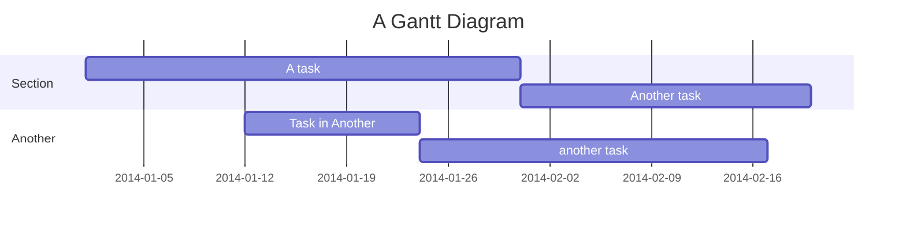

+++
title = "El ajo picó a la col"
tags = [
    "j",
]
+++

El ajo picó a la col, La col picó al ajo Ajo, col y caracol Caracol y col con ajo.

# Esto es un ejemplo de diagrama

```mermaid
gantt
    title A Gantt Diagram
    dateFormat YYYY-MM-DD
    section Section
        A task          :a1, 2014-01-01, 30d
        Another task    :after a1, 20d
    section Another
        Task in Another :2014-01-12, 12d
        another task    :24d

```
